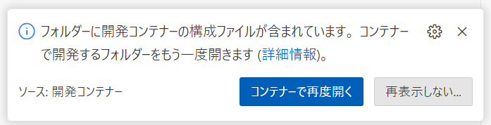
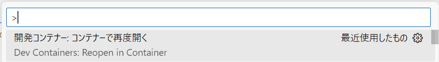

# Next.js（SSG:Static Site Generation)の開発環境

## 概要

Next.js（SSG:Static Site Generation)用の開発環境

## 構成

### Visual Studio Code の拡張機能

| カテゴリ       | 拡張機能名                                                                                                                                | 説明                             |
| :------------- | :---------------------------------------------------------------------------------------------------------------------------------------- | :------------------------------- |
| TypeScript     | [ESLink](https://marketplace.visualstudio.com/items?itemName=dbaeumer.vscode-eslint)                                                      | リンター                         |
|                | [Prettier](https://marketplace.visualstudio.com/items?itemName=esbenp.prettier-vscode)                                                    | コードフォーマッタ               |
| 開発支援ツール | [IntelliCode](https://marketplace.visualstudio.com/items?itemName=VisualStudioExptTeam.vscodeintellicode)                                 | AI 支援                          |
|                | [IntelliCode API Usage Examples](https://marketplace.visualstudio.com/items?itemName=VisualStudioExptTeam.intellicode-api-usage-examples) | AI 支援（API の使用例表示）      |
|                | [IntelliCode Completions](https://marketplace.visualstudio.com/items?itemName=VisualStudioExptTeam.vscodeintellicode-completions)         | AI 支援（コード補完）            |
|                | [Code Spell Checker](https://marketplace.visualstudio.com/items?itemName=streetsidesoftware.code-spell-checker)                           | スペルチェッカー                 |
|                | [YAML](https://marketplace.visualstudio.com/items?itemName=redhat.vscode-yaml)                                                            | リンター＆コードフォーマッタ     |
|                | [VS Code Counter](https://marketplace.visualstudio.com/items?itemName=uctakeoff.vscode-counter)                                           | ステップカウンター               |
|                | [Bookmarks](https://marketplace.visualstudio.com/items?itemName=alefragnani.Bookmarks)                                                    | ブックマーク                     |
|                | [Error Lens](https://marketplace.visualstudio.com/items?itemName=usernamehw.errorlens)                                                    | エラーメッセージのインライン表示 |
|                | [Material Icon Theme](https://marketplace.visualstudio.com/items?itemName=PKief.material-icon-theme)                                      | アイコン                         |
| AWS            | [AWS Toolkit](https://marketplace.visualstudio.com/items?itemName=AmazonWebServices.aws-toolkit-vscode)                                   | AWS 操作                         |
| Markdown       | [Markdown Preview Enhanced](https://marketplace.visualstudio.com/items?itemName=shd101wyy.markdown-preview-enhanced)                      | Markdown プレビュー              |
|                | [markdownlint](https://marketplace.visualstudio.com/items?itemName=DavidAnson.vscode-markdownlint)                                        | リンター                         |
|                | [Markdown Table](https://marketplace.visualstudio.com/items?itemName=TakumiI.markdowntable)                                               | Markdown のテーブル作成支援      |
|                | [Paste Image](https://marketplace.visualstudio.com/items?itemName=mushan.vscode-paste-image)                                              | 画像の貼り付け                   |
| ドキュメント   | [Draw.io Integration](https://marketplace.visualstudio.com/items?itemName=hediet.vscode-drawio)                                           | 作図ツール                       |
|                | [OpenAPI (Swagger) Editor](https://marketplace.visualstudio.com/items?itemName=42Crunch.vscode-openapi)                                   | OpenAPI エディタ                 |
| テスト         | [REST Client](https://marketplace.visualstudio.com/items?itemName=humao.rest-client)                                                      | HTTP リクエストツール            |

### Node.js パッケージ

| パッケージ名                                                                     | 説明                               |
| :------------------------------------------------------------------------------- | :--------------------------------- |
| [next](https://www.npmjs.com/package/next)                                       | Web アプリケーションフレームワーク |
| [@tanstack/react-query](https://www.npmjs.com/package/@tanstack/react-query)     | データフェッチライブラリ           |
| [@tanstack/react-table](https://www.npmjs.com/package/@tanstack/react-table)     | ヘッドレス UI テーブルライブラリ   |
| [@tanstack/react-virtual](https://www.npmjs.com/package/@tanstack/react-virtual) | 仮想スクロールライブラリ           |
| [react-bootstrap](https://www.npmjs.com/package/react-bootstrap)                 | CSS フレームワーク                 |
| [fabricjs-react](https://www.npmjs.com/package/fabricjs-react)                   | canvas 機能拡張ライブラリ          |

## 構築

### Windows

#### Dev Container を利用する場合

1. 以下のアプリケーションをインストールし、起動する

   ```cmd
   winget install -e --id suse.RancherDesktop
   winget install -e --id Microsoft.VisualStudioCode
   ```

2. Visual Studio Code に以下の拡張機能をインストールする

   [Remote Development](https://marketplace.visualstudio.com/items?itemName=ms-vscode-remote.vscode-remote-extensionpack)

3. Visual Studio Code に本リポジトリを「フォルダを開く」で追加する  
   [ファイル(F)]-[フォルダを開く...]

4. 以下が表示されるので「コンテナーを再度開く」を選択する

   </br>
   もしくは Ctrl+Shift+P で「Dev Containers: ReOpen in Container」を実行する  
   

#### Dev Container を利用しない場合

1. nvs (Node Version Switcher)のインストール

   ```cmd
   winget install -e --id jasongin.nvs
   ```

2. Node.js のインストール

   ```cmd
   nvs add lts
   ```

   PowerShell で「このシステムではスクリプトの実行が無効になっている」のエラーが発生する場合は、以下のコマンドを実行してスクリプトの実行を許可させる

   ```cmd
   Set-ExecutionPolicy RemoteSigned -Scope CurrentUser
   ```

3. パッケージのインストール

   ```cmd
   nvs lts
   npm i
   ```

4. Markdown ファイルで PlantUML を利用する場合
   [plantuml.jar](https://github.com/plantuml/plantuml/releases) をダウンロードして lib フォルダに「plantuml.jar」のファイル名で格納する

## 実行

1. Node.js の有効化

   ```cmd
   nvs lts
   ```

2. Next.js のデバッグ実行

   ```cmd
   npm run dev
   ```
